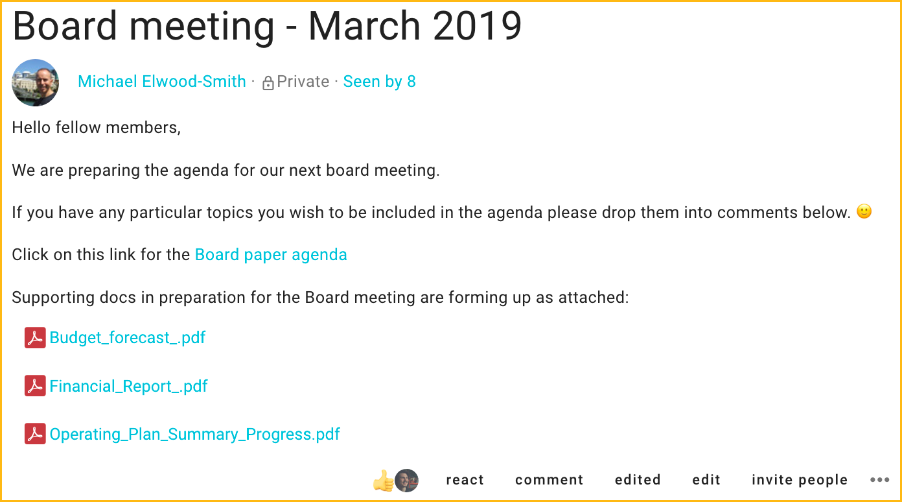
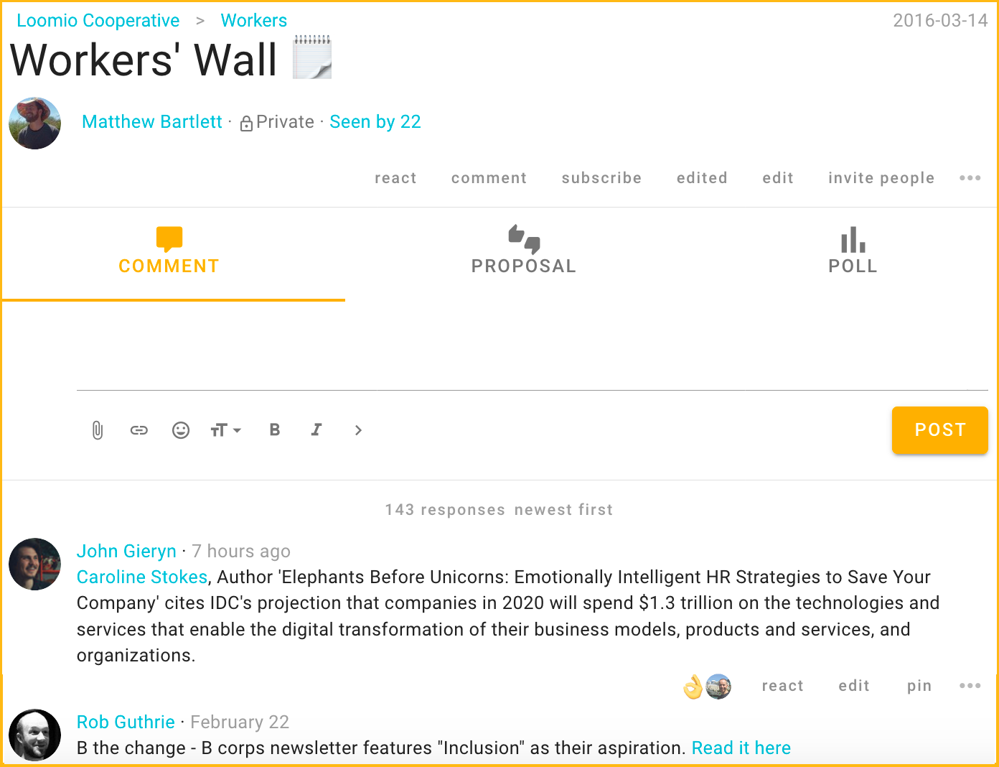
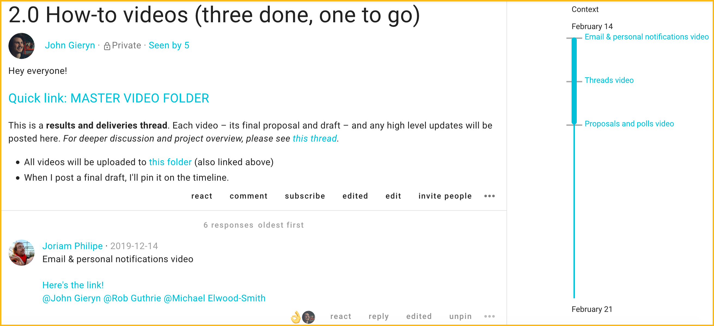
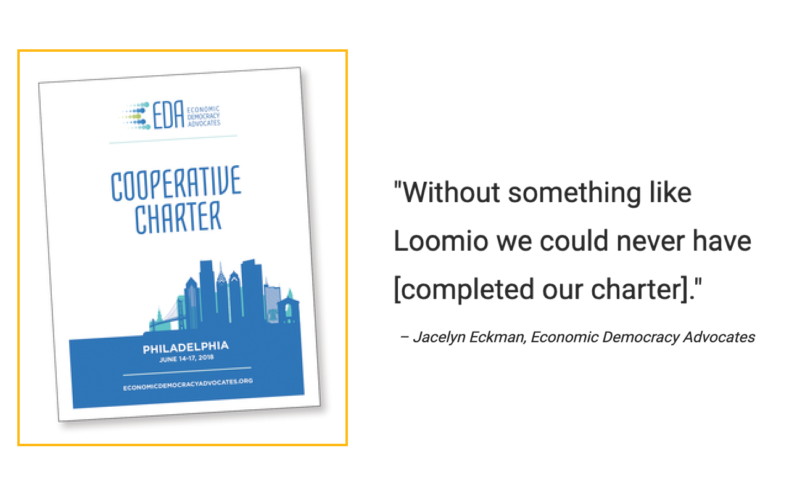
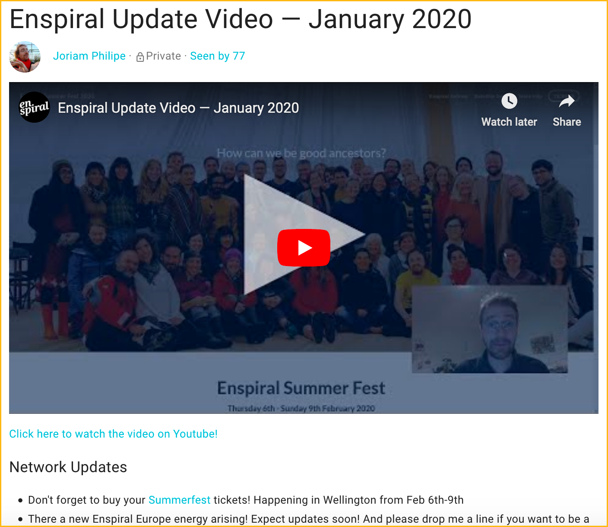

This article will guide you through **five powerful ways to use threads** that have been tried and tested over the years by groups around the world.

1. [Ask a question](#ask-a-question)
2. [Prepare for an event](#prepare-for-an-event-or-meeting)
3. [Take a document to completion](#take-a-document-to-completion)
4. [Post things over time](#post-ideas-or-introductions-over-time)
4. [Report and reflect](#report-and-reflect)
6. [Make announcements](#bonus-make-announcements) (Bonus!)

## Ask a question
_Brainstorm, explore, open…_

Most productive conversations start with questions (“[divergence](https://help.loomio.org/en/facilitators_guide/underway/#balancing-divergent--convergent)”, in our Facilitator Guide).

Start a new thread for each new inquiry; an inquiry can include several related questions. Use open questions to explore and get more engagement. Engage people directly by **@mentioning** them and asking them specifically. If you can, name any clear, shared outcome or understanding that results. As with any thread, a clear, simple title will help people find answers to engage now and reflect on down the road.

**Tip:** When scheduling, use a **time poll** to more easily gather responses and see what times align for even the largest groups.

## Prepare for an event (or meeting)
_Check in, propose, coordinate..._

Preparing for events or meetings on Loomio saves you the frustration of several different conversations and resources being scattered across several email chains. Start one thread per event; for a board meeting you might use one thread to pick a date, collaborate on agenda-setting, post minutes, record actions & follow-up on actions. **Edit** the thread context, which always stays at the top, to let people know what kind of participation is being asked for right now. Especially if they missed the meeting… you can **attach** audio, link notes, or **embed** videos too, helping people to jump right into any ongoing conversation.

**Tip:** To ratify minutes, see who has read the board papers, and save on meetings, use a **count poll** – [this guide](https://help.loomio.org/en/guides/governance/#supercharge-your-meetings) can get you started.

## Post ideas or introductions over time
_Share, envision, benchmark…_

Threads can be **'walls'** or **'bulletin boards'** where your group posts info, news items and ideas you'd like to share with your group. Use one thread, [pin](../../user_manual/threads/thread_admin/#pin-thread) it so that it sticks around even if used infrequently, and use **reactions** to keep it energized, letting people know you saw what they shared or how you felt about it.

**Tips:**

- Organize comments to appear **newest first** – [here’s how](../../user_manual/threads/navigating_threads/#oldest-or-newest-first)
- If this is new for your group, write a context!
- If your group members are new to one another, create an **Introductions thread**.

## Take a document to completion
_Co-create, approve, finalize…_

When you need to collaborate to prepare a document, video, or other content, start one discussion thread and link or attach the key artifact in the context. *Large, complicated documents with multiple decisions or reviewers may require several threads; each thread might be a chapter or article.* ¹

**Tip:** Use **proposals** and **outcomes** (once your proposal or poll has closed) ² so that everyone is clear on what’s next.

## Report and reflect
_Feedback, review, retrospect…_

It’s valuable to invite reflection, evaluate how things have gone, and give and receive feedback. Many agile teams take advantage of our software, improving their retrospectives by using Loomio’s discussion threads.

Use one thread to report information to your group, such as weekly metric reports. If you expect a high volume of questions or comments on each report, then use one thread for each reflection.

**Tip:** Start a **poll** to collect input and more visibly track engagement… you may know what happens [when the second person joins the dancing](https://www.youtube.com/watch?v=fW8amMCVAJQ).

## BONUS: Make announcements
*Notify, acknowledge, track…*

Sometimes all you need to do is get the right information to the right people. You can use Loomio for your announcements, status updates, or even your newsletter. If you want everyone to receive it promptly, start your thread, choose your group members, and **send**.

**Tip:** Not ready to email everyone? You can always click **invite people** to send it later. Loomio can help you make sure everyone receives it (use **Notification History**).³

---

**What about decisions, proposals and polls?** The best tool for making decisions is good discussion; it's the best way to frame the topic, seek input, and gather ideas. Often you'll find that you can make progress with comments and replies. Other times, you will want the clear calls to engagement and facilitation support that polls and proposals can provide in order to bring the discussion to a clear outcome.

Now that you’ve learned some of the best practices for discussion threads that result in clear actionable outcomes or valuable shared understanding, try starting a “Wall” thread in your group, and share this article with your group!

---

¹ *Read Economic Democracy Advocates’ story [here](https://blog.loomio.org/2019/07/11/regenerating-the-earth-for-future-generations/)*   ² *Learn how to use outcomes [here](https://help.loomio.org/en/user_manual/polls/outcomes/)*   ³ *Learn how to track engagement [here](../../user_manual/threads/thread_admin/#tracking-engagement)*
