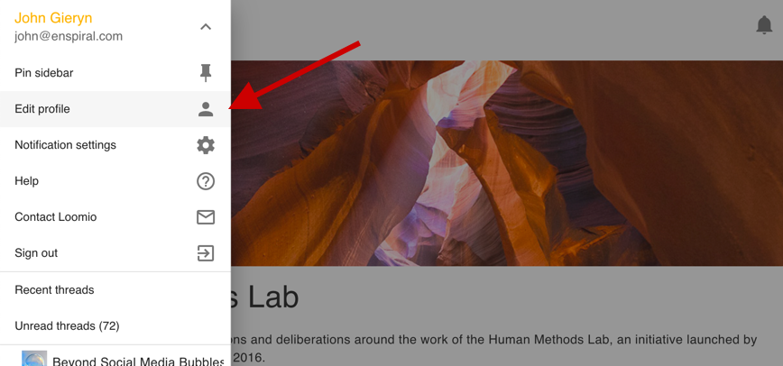

## Configure your email settings

Email notifications are an important way for Loomio to keep people updated on what's happening in your group.

<iframe width="100%" height="380px" src="https://www.youtube-nocookie.com/embed/0Mb2_D74ktM?rel=0" frameborder="0" allowfullscreen></iframe>

When you (or your group members) start your account, by _default,_ Loomio will:

- send you a **daily summary email** of everything you missed the day before
- let you know when someone's trying to get your attention via **mentions & replies**
- **subscribe upon participation**, sending emails for every comment on threads you're interested in.
- immediately email you **when someone asks for your attention**: notifications of polls or proposals or thread invitations

This helps to keep people engaged in the early stages of a group. We set this default assuming that you and your group members will not yet have a habit of using Loomio regularly. For this reason, the default makes it easier for you to stay up to date via your email inbox.

To change these settings, go to your [notification settings](https://www.loomio.org/email_preferences). This is where you can change your notification preferences for all groups at once. [Learn more](/en/user_manual/users/email_settings/#group-email-preferences).

You can also set notification settings specific to any group or subgroup.

1. Click on your group page
2. Click on the tab, **Settings**
3. **Email settings** will be the first listed

You can apply this setting to the **organization** (a.k.a. parent group) alone _or_ to the parent group and all of its subgroups.

## Profile settings

Your profile page lets you customize your Loomio identity. To visit your profile page select the **edit profile** option in the user menu.

## Uploading a profile photo
It helps people to know who they are speaking to, and put a face to a name. In getting started, you will want to choose or upload a [profile photo](/en/user_manual/users/user_profile/#uploading-a-profile-photo).

## Update your personal info

Updating your [introduction](/en/user_manual/users/user_profile/#update-your-personal-info), perhaps including skills or roles, and your location (especially for remote teams) can help build your teams.

## Language settings
Loomio is developed in English, but [is translated by volunteers into many languages](https://www.loomio.org/g/cpaM3Hsv/loomio-community-translation).

Loomio will detect your browser’s language settings, but you can manually [set your preferred language](/en/user_manual/users/user_profile/#language-settings) from the profile page.

## Setting a password
You can set or change your password by visiting your profile page and clicking [**Reset Password**](/en/user_manual/users/user_profile/#resetting-your-password).

---

## To recap

Check out the [Loomio Basics **video** series](/en/overview-and-how-tos) and review most of the Getting Started Guide in as little as 15 minutes.

## Convincing your group

Our [onboarding resources](../../activating) can help you get everyone on board to adopt Loomio.
