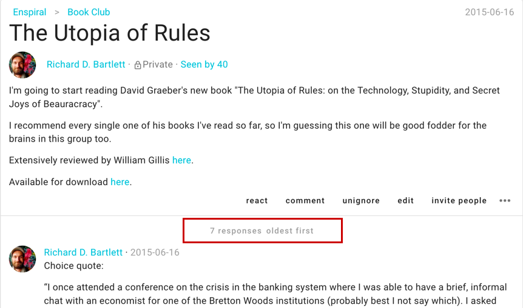
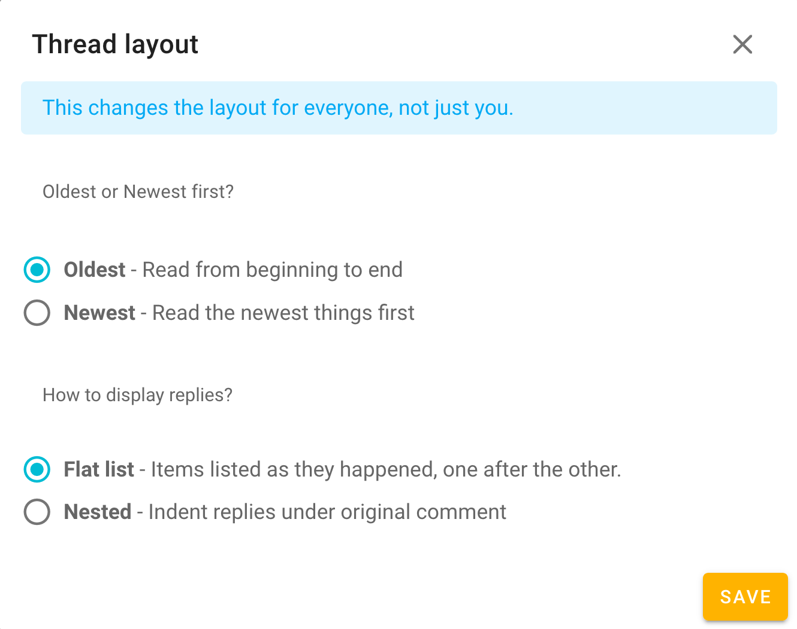

## Context
The thread **context** has special status within a thread. It's always at the top, and it's always visible on the page. It's typically used to frame the discussion or decision and provide necessary context. Learn more about engaging with the thread context [here](../engaging_with_threads/#thread-context).

## Timeline

The timeline helps you and your group to quickly access content (conversations, questions, decisions…). It is a visual, interactive history of key events, processes, or milestones that helps your group to understand how a conversation evolved over time or to review how a given outcome came about.

To facilitate this, comments with headers, proposals, and polls are automatically added to the timeline as links. Clicking these links take you directly to this item in the thread. Learn how to edit timeline items [here](../thread_admin/#pin-to-timeline).

The date of the earliest thread activity, and the latest, are not blue but **can be clicked to quickly navigate, too!** Click on the dates or "**Context**" to navigate to the earliest or latest comment or to the top (the context).

## Navigating activity and Thread format

Thread **activity** is comprised of all the comments, replies, proposals, polls, votes and other notable things that happen within the thread. There are two ways you can alter how that activity is displayed in order to optimize the experience given a specific thread's purpose:

### Oldest or Newest first

By default, this activity is 1.) listed with the oldest activity nearest the top, or **oldest first**, and 2.) nested, which means a reply will be displayed just under the comment to which it is responding and the proposals and polls will result in a nice list of responses/positions directly under the area where folks engage with them.

The grey text just under the context will indicate in which order the activity is being listed, along with the number of replies.

To change this setting, click that grey text, choose your preference, and save. _This changes the layout for everyone, not just you._

> **Tip:** Long threads, for example your organization's 'wall' for off-topic sharing, often benefit from the setting **newest first**

### How replies are displayed

The thread can also be set to display chronologically, as a **flat list**, where all activity is displayed in the order that it happened. _Again, this setting is for all thread members as threads are viewed in the same way by everyone._

Similar to switching oldest for newest first, change how replies are displayed by clicking the grey text under the context to first open **Thread layout** options, select your preference, and save.

## Unread activity
When you open a thread on Loomio you will first be taken to unread (or unseen) activity. When activity items are displayed on your screen, Loomio will take note that they have been read, _just like if you see the activity via an email._ Unread content is displayed with a yellow stripe on the left side and threads with unread content display bold within thread lists.
