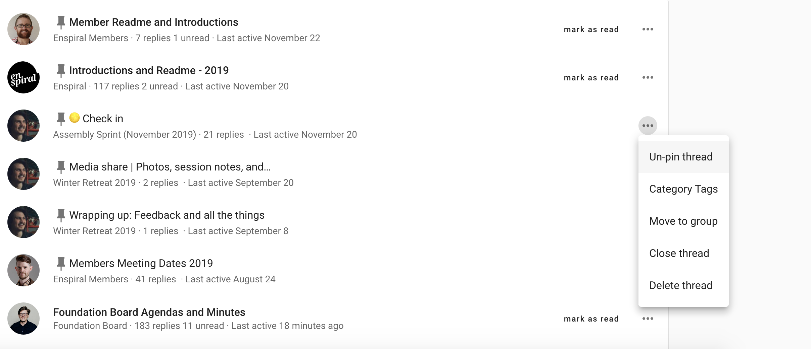
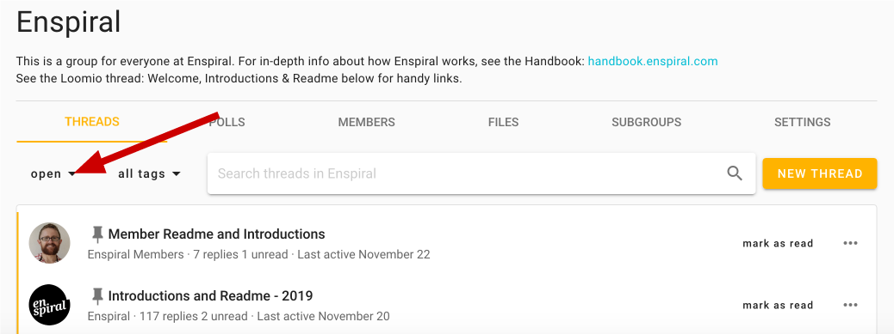
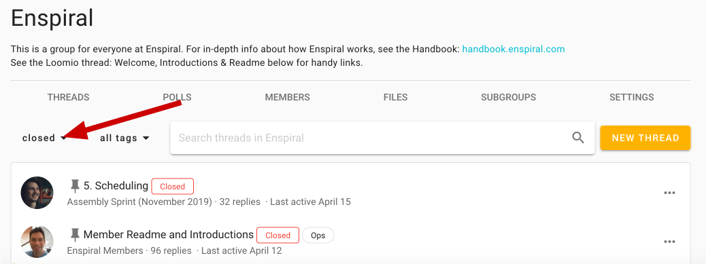
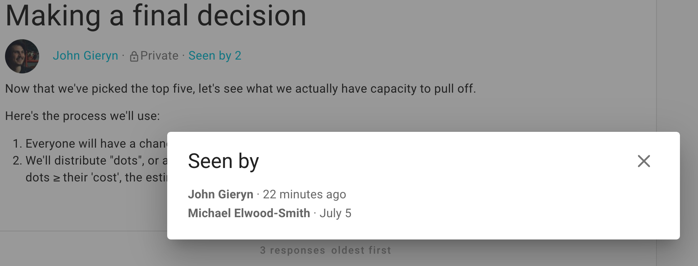

To get the most out of the effectiveness and efficiency that Loomio offers, you may want to manage the discussion threads and the communications they contain.

While some of these actions are taken from _within_ threads, we'll start outside the threads, on any page where threads are listed (Group, Unread threads, or Recent threads page).

## Understanding thread previews

To help you stay on top of everything, the thread preview is a quick glance at the some important details about a thread. Thread previews appear on any page that lists threads.

It shows

- The title
- Who first authored it - _the picture or initials to the left of the title_
- If it has an active proposal or poll - _a relevant visual/graph will replace the author_

> _Note:_ your participation (eg, Agree) is superimposed on this graph. A question mark indicates you have not participated

- What group or subgroup it is in - _just below the title_
- How many comments or votes - _X replies_
- If there has been activity that you haven't seen yet - _yellow stripe on the left_
- How many of these you have yet to see - _Y unread_
- When the last comment or vote was submitted - _Last active Z ago_

# Top-level options

You can access a number of options by selecting the three horizontal dots (**⋯**) to the right of a thread's title , opening the **thread preview options**. The following administrative actions are taken from those options (only on pages that list threads).

### Pin thread
If you are a coordinator, you can pin comments to order them and make them easier to find. Pinned threads will appear above your other threads and will be ordered alphanumerically within their group and organization.

You can easily  **pin** or **un-pin** from the thread preview options, but **only from the Group page**.

### Close thread

To keep the list of discussions on your group page relevant, you can close threads which people don't need to see.

To view closed threads, first navigate to the relevant **group page**. You will need to use the drop-down just under the Threads tab to change the thread filter from its default of **open**.

Choose "closed" to view all your closed threads in the thread filter.

#### Re-open thread

Re-opening a closed thread is done from within the thread's page – again, the three horizontal dots (**⋯**). See [organizing threads](#organizing-threads) for a depiction.

# Options within threads

## Thread context

Threads are easily updated and edited by those with permission to by clicking **edit**.

> **Tip:** Double-clicking a thread context also opens the context editor.

Learn more about thread contexts [here](../navigating_threads).

## Organizing threads

The following administrative actions may be taken from within the thread, and in some cases from pages that list threads (thread preview options). To find these options, go to the page of the thread in question and use the **⋯** three horizontal dots to the right of the basic thread actions at the bottom of the context.

### Category tags

**Category tags** (or just "tags") let you group any number of threads by categories that you define. You can use them to make it easy to find threads of a certain type or topic.

To apply a tag to a thread, go into the thread's options and choose Category tags. Select the desired tag(s) from the dropdown list of tags that your group already uses, or type in a new tag and press the enter key. Finally, click **Save**.

<iframe width="100%" height="380px" src="https://www.youtube-nocookie.com/embed/X40wuMaZ-8E?rel=0" frameborder="0" allowfullscreen></iframe>

### Move thread

You may want to move threads between groups and subgroups to keep things organised. To do this, select **move to group** from the additional options

<iframe width="100%" height="380px" src="https://www.youtube-nocookie.com/embed/59T3xCK-jys?rel=0" frameborder="0" allowfullscreen></iframe>

### Delete thread

If you're the admin of a group you can delete any thread – or comments in any of the threads – in the group.

If you started a thread, you can delete that thread, but only your comments within it.

## Invite guests to thread

Consult an expert or external party while keeping relevant communications all in one place: Invite them to a specific thread by using **invite people**, at the bottom of the thread's context. They won't get access to any other threads in your group, just this one. They do not need to already have a Loomio account, and they can participate by email just like all Loomio users.  _If you_ do _want them to be in the group, then invite them to join from the group page._

## Administering comments and decisions

The following are achieved from any comment by first clicking on the three horizontal dots (**⋯**) at the bottom-right of the comment, proposal, or poll in question.

### Deleting comments
You can delete your own comments at any time.

Again, an admin can delete any comment.

Select **delete** from the comment's options (**⋯**).

<iframe width="100%" height="380px" src="https://www.youtube-nocookie.com/embed/cGc8_1zWrzE?rel=0" frameborder="0" allowfullscreen></iframe>

### Moving comments
Sometimes a comment is useful, but off-topic for the thread; _it may be a short conversation took place that would have been better held in another thread or subgroup._ In this case you will want to **move** comment(s) by selecting this option in the comment's options (**⋯**). If the topic of these comments does not pertain to a current thread, then you may wish to first start a new thread and _then_ move the comment(s).

<iframe width="100%" height="380px" src="https://www.youtube-nocookie.com/embed/qaaQkA2myRc?rel=0" frameborder="0" allowfullscreen></iframe>

### Pin to timeline

The timeline helps you and your group to quickly access content (conversations, questions, decisions…). It is a visual, interactive history of key events, processes, or milestones that helps your group to understand how a conversation evolved over time or to review how a given outcome came about.

To facilitate this, comments with headers, proposals, and polls are automatically added to the timeline as links. Clicking these links take you directly to this item in the thread.

#### Add, remove, or edit timeline items

To add, remove, or edit timeline items, either click the word **pin** or **unpin** at the bottom-right of any comment, proposal, or poll.

To edit the words used in the timeline: unpin and then pin it again; this will give you the opportunity to reword the text that appears as a link in the timeline.

> **Tip:** Highlight the words that you would like to use as the text in the timeline

<iframe width="100%" height="380px" src="https://www.youtube-nocookie.com/embed/Dy8Hi_QM-Gw?rel=0" frameborder="0" allowfullscreen></iframe>

## Tracking engagement

### Seen by

Just under the thread title you can click **Seen by** to see who has or has not seen the thread.

### Notification history

You can check if someone has been sent an email notification about a thread, decision, or comment. Additionally, you can see if they have _opened_ this notification email or if they saw it on Loomio.

#### For comments and threads
In the extra options you find from the three horizontal dots (**⋯**), click **Notification history**.

<iframe width="100%" height="380px" src="https://www.youtube-nocookie.com/embed/rk1r7bkuiMo?rel=0" frameborder="0" allowfullscreen></iframe>

#### For proposals and polls
Click on **invite people to vote** under the Results section of your proposal or poll, and then click **History** to see who has been invited to – and who has viewed the notification of – your proposal or poll.

<iframe width="100%" height="380px" src="https://www.youtube-nocookie.com/embed/0fR3TAeBS6I?rel=0" frameborder="0" allowfullscreen></iframe>

Here's how it looks if you sent some notifications:

